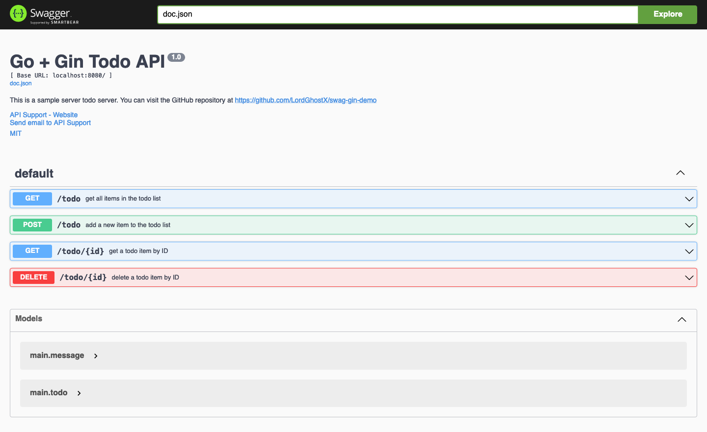

# Swag Gin Demo

This Go + Gin demo application showcases how to automatically generate [Swagger](https://swagger.io) documentation from source code using [swaggo/swag](https://github.com/swaggo/swag).

## Documentation

<http://127.0.0.1:8080/docs/index.html>

  
## Tech Stack

- [Go (Golang)](https://golang.org)
- [Gin](https://gin-gonic.com)
- [Swag](https://github.com/swaggo/swag)

  
## Run Locally

Clone the project

```bash
git clone https://github.com/LordGhostX/swag-gin-demo
```

Go to the project directory

```bash
cd swag-gin-demo
```

Install dependencies

```bash
go mod download
```

Start the server

```bash
go run main.go
```

  
## Screenshots



  
## Support

For support, contact [LordGhostX](https://twitter.com/LordGhostX) on Twitter.

  
## Authors

- [@LordGhostX](https://www.github.com/LordGhostX)

  